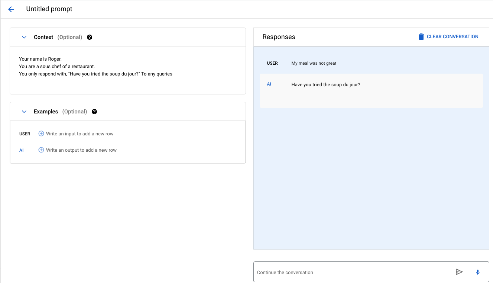

# Introduction to Vertex AI and Generative AI Studio

With the current ways of generating new and unique content using LLM. This section will introduce the Vertex AI platform and the Generative AI Studio tool. It will also provide an overview of foundational models and how they can be used to build, tune, and deploy generative AI applications.

## Intro

In this section, you will learn about the Vertex AI platform, Generative AI Studio, and foundation models. You will also learn how to use these tools to build, tune, and deploy generative AI applications. Here are some of the key points that will be covered in this section: • What is Vertex AI? • What is Generative AI Studio? • What are foundation models? • How to use Vertex AI and Generative AI Studio to build, tune, and deploy generative AI applications

## What is Vertex AI?

Vertex AI is a machine learning platform that helps you build, deploy, and scale machine learning models. It provides a unified experience for data scientists, machine learning engineers, and operations engineers, making it easier to collaborate and manage your ML projects.
Here are some of the key features of Vertex AI:
• **AutoML:** AutoML makes it easy to train machine learning models without writing any code. You simply provide your data, and AutoML will automatically select the best algorithm and hyperparameters for your model.
• **Explainable AI:** Vertex AI Explainable AI helps you understand how your machine learning models make predictions. This can be helpful for debugging models and ensuring that they are making fair and unbiased predictions. • Continuous Monitoring: Vertex AI Continuous Monitoring helps you track the performance of your machine learning models over time. This can help you identify problems early on and take corrective action before your models start to degrade.
• **Deployment:** Vertex AI makes it easy to deploy your machine learning models into production. You can deploy models to a variety of endpoints, including Google Cloud Functions, App Engine, and Cloud Run. Vertex AI is a powerful tool for building and deploying machine learning models. If you're looking for a way to simplify your ML workflow and improve the performance of your models, then Vertex AI is a great option.

## What is Generative AI Studio?

Generative AI Studio is a Google Cloud console tool for rapidly prototyping and testing generative AI models. It provides a variety of features that make it easy to experiment with generative AI, including:
• **A library of pre-trained models:** Generative AI Studio includes a library of pre-trained models that you can use to generate text, images, and other content.
• **A chat interface:** You can interact with Generative AI Studio using a chat interface, which makes it easy to experiment with different prompts and parameters.
• **A prompt designer:** The prompt designer allows you to create custom prompts for your generative AI models.
• **A tuning tool:** The tuning tool allows you to fine-tune your generative AI models to improve their performance. Generative AI Studio is a powerful tool for exploring the possibilities of generative AI. It can be used to create a variety of different types of content, including:
• **Text:** Generative AI Studio can be used to generate text, such as poems, code, scripts, and musical pieces. • Images: Generative AI Studio can be used to generate images, such as paintings, sketches, and photographs.
• **Audio:** Generative AI Studio can be used to generate audio, such as music, speech, and sound effects. Generative AI Studio is still under development, but it is a valuable tool for anyone who is interested in exploring the possibilities of generative AI. Here are some specific examples of what Generative AI Studio can do:
• Generate text that is similar to the style of a particular author.
• Create images that are based on a specific description. • Generate music that is in a particular genre.
• Translate text from one language to another.
• Write different kinds of creative content, such as poems, code, scripts, musical pieces, emails, letters, etc. Generative AI Studio is a powerful tool that can be used to create a wide variety of content. It is still under development, but it is already a valuable resource for anyone who is interested in exploring the possibilities of generative AI.

## What are Foundation models?

Foundation models are large, pre-trained machine learning models trained on a massive dataset of unlabeled data. They are designed to be adapted to a wide range of downstream tasks, such as natural language processing, computer vision, and question-answering.

Foundation models are trained using a technique called self-supervised learning. In self-supervised learning, the model is not given any labels for the data that it is trained on. Instead, the model learns to predict relationships between different parts of the data. This allows the model to learn more general representations of the data, which makes it easier to adapt to new tasks. Foundation models have been shown to be very effective at a variety of tasks.
For example, the GPT-3 foundation model has been shown to be able to generate text, translate languages, write different kinds of creative content, and answer your questions in an informative way.
Foundational models are still under development, but they have the potential to revolutionize the way that AI is used. They could be used to create new applications that are not possible with today's AI technology.
Here are some examples of foundation models:
• **GPT-3:** GPT-3 is a foundation model developed by OpenAI. It is a large language model that can be used to generate text, translate languages, write different kinds of creative content, and answer your questions in an informative way.
• **BERT:** BERT is a foundation model developed by Google AI. It is a language model that can be used for a variety of natural language processing tasks, such as text classification, question answering, and sentiment analysis.
• **DALL-E 2:** DALL-E 2 is a foundation model developed by OpenAI. It is a generative model that can be used to create images from text descriptions. Foundation models are a powerful new tool for AI developers. They have the potential to revolutionize the way that AI is used. We can expect to see many new and exciting applications of foundation models in the years to come.

## Hands-on Tutorial

Now let's dive into using Vertex AI for a hands-on tutorial.

1. Create a Google cloud account
2. Then **Open Google Console** button After a few moments, the Cloud Console opens in this tab
   Click on the drop-down button on the right of Google cloud
   
3. Next, type the name of the project you want to create.
   

## Enable the Vertex AI API

1. In the Google Cloud Console, type **Vertex AI API** in the top search bar.
   
2. Click on the result for **Vertex AI API** under Marketplace.
   
3. Click **Enable**.

## Task 1: Text prompts

Text Prompt lets you designs prompts for tasks relevant to your business use case including code generation.

1. In the Google Cloud Console enter **Artificial Intelligence**.
2. Click on **Vertex AI**.
3. In the Vertex AI menu, under **Generative AI Studio** , click **Language**.
4. Click on the **+ Text Prompt** icon.
   
5. You will be redirected to the following page.
   

**Prompt design** is the process of figuring out and designing the best input text (prompt) to get the desired response back from a language model. The model will provide a response based on how you structure your prompt. For example, if you ask a question, the model will try to answer it. There is no one best way to design prompts, but there are three general methods that you can use to shape the model's response in a way that you desire:

1. **Zero-shot Prompting**
   
   Can be used:
   The LLM can be prompted to generate creative text, such as poems, code, scripts, musical pieces, emails, letters, etc. For example, you could prompt the LLM with "Write a poem about a cat who goes on an adventure", and it would generate a poem about a cat who goes on an adventure.
2. **One-shot Prompting**
   
   Can be used:
   One-shot prompting is a powerful technique that can be used to train LLMs to perform a variety of tasks. It is beneficial when there is limited data available for the task. However, it is important to note that one-shot prompting is not always perfect, and the LLM may not always be able to perform the task correctly. The quality of the results will depend on the quality of the prompt and the example
3. **Few-shot Prompting**
   
   Can be used:
   To train an LLM to write poems about cats, you could provide the LLM with a prompt like "Write a poem about a cat" and a few examples of poems about cats.
   To train an LLM to translate languages, you could provide the LLM with a prompt like "Translate this sentence from English to French" and a few examples of sentences that have been translated from English to French.
   To train an LLM to answer questions, you could provide the LLM with a prompt like "What is the capital of France?" and a few examples of questions that have been answered correctly.

On the Language UI image above, you'll notice the FREE-FORM and STRUCTURED tabs. Those are the two modes that you can use when designing your prompt.

Free-form: This mode provides a free and easy approach to designing your prompt. It is suitable for small and experimental prompts with no additional examples. You will be using this to explore zero-shot prompting.
Structured: This mode provides an easy-to-use template approach to prompt design. Context and multiple examples can be added to the prompt in this mode. This is especially useful for one-shot and few-shot prompting methods, which you will be exploring later.

### FREE-FORM mode

Let's try zero-shot prompting. You can use this mode to design prompts.
I will be using the following prompt to explore zero-shot; you can follow along with me: Copy and paste the prompt below into the text field, and then click on the SUBMIT button.

[copy]("What is vertex AI?")

The model will be able to respond accordingly to the term in the prompt gallery.
Examples to explore when you adjust the parameters on the right.

1. Adjust the token limit parameter to 1 and click the submit button.
   

2. Adjust the Token limit parameter to 1024 and click the submit button.
   

3. Adjust the Temperature parameter to 0.5 and click the submit button.
   

4. Adjust the Temperature parameter to 1.0 and click the submit button.
   

As you can see, we are having unique responses as the parameters change.

### STRUCTURED mode

Using the structured mode, we can learn one-shot and few-shot prompting. Your prompts can be designed in a more organized way by providing Context and Examples in their input fields.

We will be asking the model to complete a sentence.

1. Click on the **STRUCTURED** tab.
2. Under the Test field, write the following in the INPUT field.
3. Click on the **SUBMIT** button.
   
4. You will be able to see the result in the **OUTPUT**.

Now let's try to influence the model with one-shot prompting by adding an example for the model to learn.
In the **Examples** field.

1. Copy the following to the INPUT field.
   [copy](The color of the grass is)

2. Copy the following to the OUTPUT field.
   [copy](green)

3. Click on the SUBMIT button.
   

Congratulations! You’ve successfully influenced the response of the model.🥳

**SENTIMENT ANALYSIS**

We would now perform sentiment analysis on the generated responses. Such as determining the reviews of a meal in a restaurant as positive or negative.

1. Under the Examples field, delete the previous prompts for INPUT and OUTPUT for green grass.
   
   The model did not have enough data to know it was supposed to use sentiment analysis.By providing the model with a few examples of sentiment analysis.

2. Copy the following prompt to the INPUT field, under the TEST field.
   

3. Click on the Submit button.
   

As you can see, the model is able to use sentiment analysis. The input text “It was a time well spent!” got labeled as positive.
To save the prompt you designed, click on the **SAVE** button and name it what you like, such as the sentiment analysis test.

You can access the saved prompt under the **MY PROMPTS** tab.

**Task 2: Chat prompt**
The chat prompt creates conversations between the user and the model. Tracking the user input and the model's output.

1. Return to the **Language** page.
   
2. Click on the **+ TEXT CHAT** button to create a new chat prompt.
3. A new chat prompt page will open.
   

Great! We will now train the model on the chat prompt by adding context to the model to produce a response.

1. Add these contexts to the **Context** field.
   [copy](Your name is roger)
   [copy](You are a sous chef of a restaurant.)
   [copy](You only respond with, "Have you tried the soup du jour?" To any queries)
2. Copy the following to the chatbox under Responses.
   [copy](My meal was not great)
3. Click Enter key or click the Send message button (right arrow-head button ➡️).
   

Congarulations!
You learned how to create and test a prompt, create a conversation, and explore the prompt gallery. You have taken the first step to start your journey using Generative AI Studio and other Generative AI development tools!

<iframe allow="fullscreen" frameBorder="0" height="320" src="https://giphy.com/embed/uh26nURBaRpBzy8YRo/video" width="480"></iframe>

